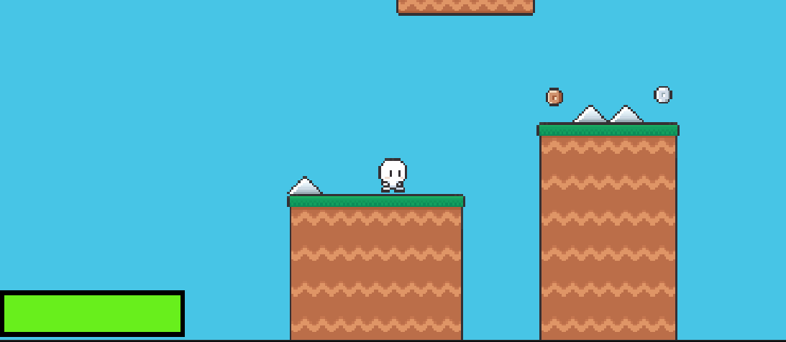

# M3Prog

Ik heb veel features toegevoegd. 

Hier heb ik de bewegingen toegevoegd voor de character samen met wat animaties.

Samen met nog wat bewegende enemies. 

Als je bijvoorbeeld een spike aanraakt dan neem je 25 damage en als je dood gaat respawn je weer.

De double jump feature. Makkelijk om moeilijke plekken te bereiken. De platform beweegt. Ik had wel wat errors met de code en de platform ging te snel.

De coins hebben allemaal een animatie en geven een oplopende score.

De finish werkt. De Next Level button is nog een work in progress, maar het level herstarten doet het prima.

Ik heb een test playthrough gedaan door de levels. 4 levels totaal. Ik ga nog een menu maken waarbij je levels kan kiezen.